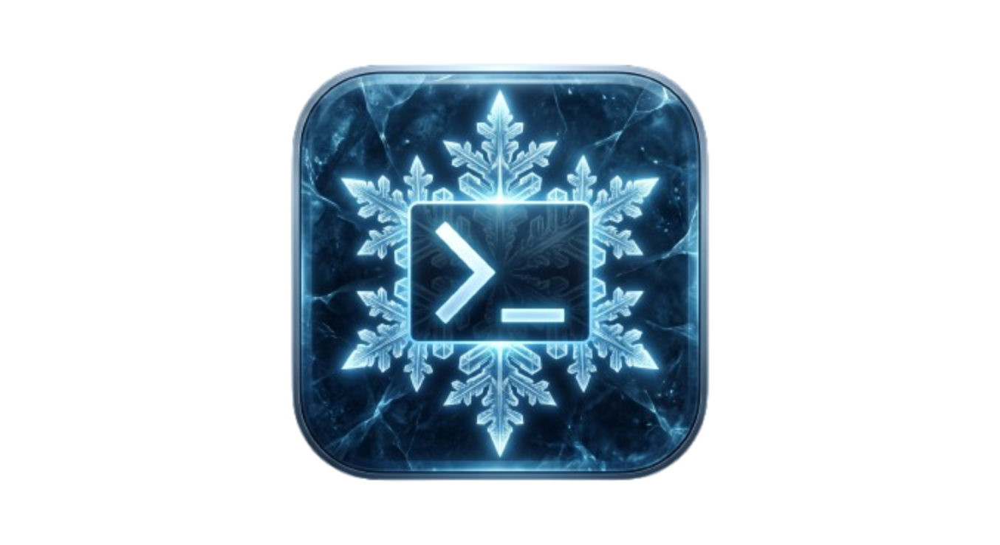
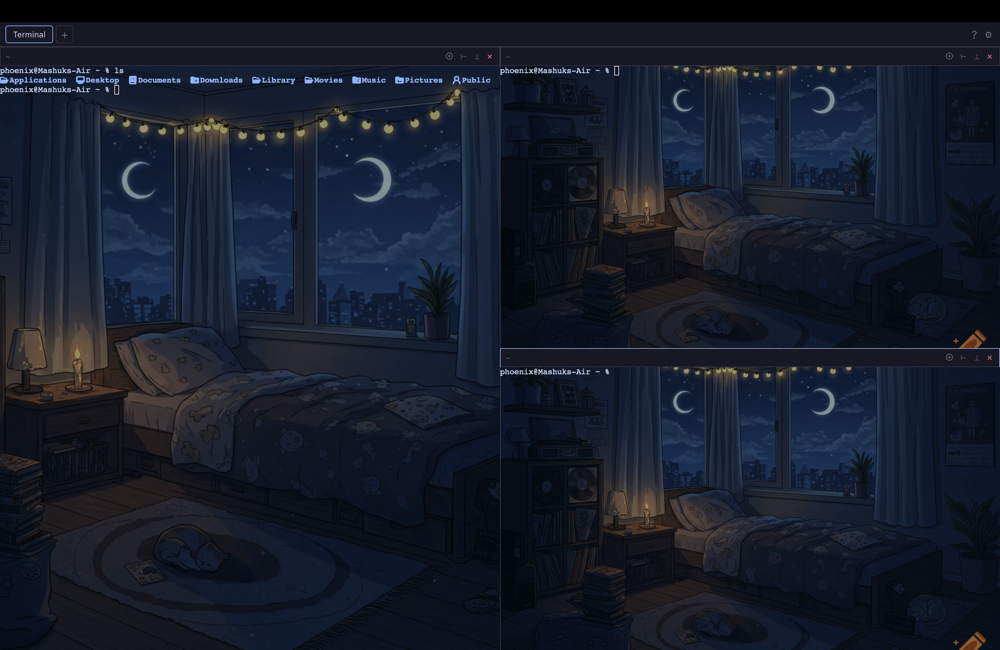

<p align="center">
  
</p>

<h1 align="center">Glacier</h1>

<p align="center">
  <strong>A fast, modern terminal for macOS.</strong><br/>
  Built with Rust + Tauri. Designed for the way you actually work.
</p>

<p align="center">
  
  
  
  
  
</p>

<p align="center">
  <b>First release available.</b> Download the DMG below.
</p>

<p align="center">
  
</p>

---

## Install

1. Go to [Releases](https://github.com/pranjolm/glacier-terminal/releases) and download the latest `.dmg`
2. Double-click the DMG, drag **Glacier** to Applications
3. Done. No Rust, no Node.js, no Homebrew — the app is fully self-contained.

**Requirements:** macOS 13+ (Apple Silicon)

**⚠️ "Glacier is damaged" warning:**
Because the app is not yet code-signed, macOS may show a "damaged" dialog on first launch after downloading from GitHub. This is just Gatekeeper being cautious. To fix it, run this in Terminal:

```bash
xattr -cr /Applications/Glacier.app
```

Then open Glacier normally. (A proper Apple Developer code signature will be added in a future release.)

## Why Glacier?

Most terminal emulators haven't changed much in twenty years. Glacier rethinks the terminal as a first-class macOS app — fast, native, and actually pleasant to use.

- **Auto-tiling panes** — split naturally with `⌘ D`. No tmux key chords, no config files. Draggable dividers resize panes in real time.
- **File icons out of the box** — Glacier bundles `lsd`, a modern `ls` replacement with file-type icons. Your first `ls` already looks great. No Homebrew installs, no font patching.
- **Custom background images** — set any image as your terminal background with adjustable opacity. Pick a photo, a gradient, or keep it solid.
- **Live font & theme switching** — change fonts, sizes, and color themes without restarting. Built-in themes plus custom CSS property support.
- **Clickable everything** — `⌘+click` paths to reveal them in Finder, `⌘+click` URLs to open them in your browser.
- **True native feel** — copy, paste, and drag behave exactly like every other Mac app. `⌘ C` copies selection, `⌘ V` pastes with bracketed paste support.
- **Built-in help** — press `F1` or click the `?` button to see all keyboard shortcuts. No browser tabs, no external links.
- **Inline autocomplete** (work in progress) — ghost text suggestions from your shell history and completions. Currently being fixed.

## Keyboard Shortcuts

All shortcuts work out of the box — no configuration needed. Press `F1` inside Glacier to see this list anytime.

| Shortcut | Action |
|---|---|
| `⌘ D` | Split pane (auto-tile direction) |
| `⌘ W` | Close active pane |
| `⌘ T` | New tab |
| `⌘ ,` | Settings |
| `⌘ C` | Copy selection |
| `⌘ V` | Paste |
| `⌘ Click` | Open path in Finder / open URL in browser |
| `Tab` / `→` | Accept autocomplete suggestion |
| `Esc` | Close panel or modal |
| `F1` | Show keyboard shortcuts help |

## Tech Stack

| Layer | Technology |
|---|---|
| App shell | Tauri 2.x (Rust) |
| UI | React 19 + TypeScript + Vite 6 |
| Terminal renderer | xterm.js 5.3 + WebGL addon |
| PTY backend | `portable-pty` (Rust / async Tokio) |
| State management | Zustand 5 + Immer |
| Pane splitting | `allotment` |
| Settings persistence | `tauri-plugin-store` |

## Architecture Highlights

- **Zero system modifications** — shell integration scripts live in `~/.config/glacier/` and are injected via environment variables. Your `.zshrc`, `.bashrc`, and Fish config are never touched.
- **Streaming OSC parser** — a custom state machine in Rust parses OSC sequences (cwd tracking, autocomplete hints, semantic prompts) in real time without buffering the entire PTY stream.
- **Base64-safe IPC** — raw PTY bytes are base64-encoded across the Tauri boundary so incomplete UTF-8 sequences at chunk boundaries never corrupt the terminal state.
- **Pane tree** — panes are stored as a binary tree (`leaf | split`), making recursive layout, split, and close operations trivial and predictable.
- **Self-contained tools** — `lsd` is bundled inside the `.app` and extracted to `~/Library/Application Support/com.glacier.app/bin/` on first launch. Shell integration scripts prepend this directory to `PATH` automatically.

## Development

You need a Mac with **Rust** and **Node.js 20+** installed.

```bash
# Install dependencies
npm install

# Run in dev mode (hot reload for both Rust and TypeScript)
npm run tauri dev

# Build a release DMG
npm run tauri build
```

## Roadmap

- [x] PTY core (create / write / resize / kill sessions)
- [x] Auto-tiling pane tree with draggable splits
- [x] Shell integration (Fish, Zsh, Bash) — cwd tracking, autocomplete
- [x] Cmd+click path / URL handling
- [x] Copy / paste with bracketed paste support
- [x] Live theme, font, and background settings
- [x] Built-in help panel with shortcuts
- [ ] Inline autocomplete fix
- [ ] Search / find in terminal
- [ ] Custom keybindings
- [ ] Plugin system for custom OSC handlers
- [ ] Windows / Linux port

## For Maintainers: Releasing

1. Build: `npm run tauri build`
2. Draft a release on GitHub, tag it (e.g. `v0.1.0`)
3. Attach the `.dmg` from `src-tauri/target/release/bundle/dmg/`

**Note:** The Mac App Store is not an option — sandboxing breaks PTY access, shell spawning, and Finder integration. Terminal apps and the App Store don't mix.

**Future:** Submit a Homebrew Cask once you have a few releases so users can `brew install --cask glacier-terminal`.

## Feedback & Contributing

Glacier is early. If you have ideas, find bugs, or just want to rant about terminals, open an issue or start a discussion. Every piece of feedback shapes what the next release looks like.

Pull requests are welcome for small, focused improvements. For larger changes, please open an issue first so we can align on direction.

## License

Glacier itself is licensed under the **MIT License**. See [LICENSE](./LICENSE).

This project bundles a prebuilt binary of [`lsd`](https://github.com/lsd-rs/lsd), which is licensed under the **Apache License 2.0**. The `lsd` binary and its license are included in `src-tauri/resources/lsd/`.
